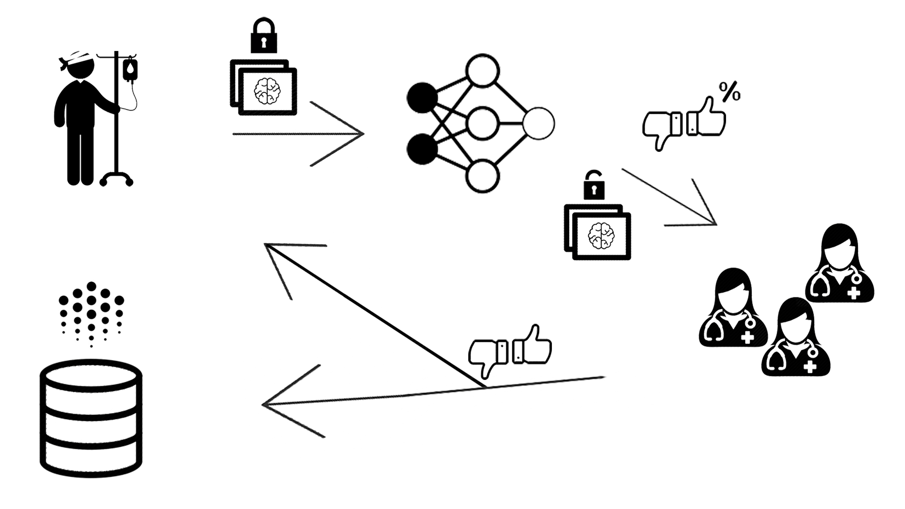

# Team-32

# CrypDoc 👨‍⚕️👩‍⚕️

## Inspiration
Taking advantage of work distribution upon doctors. In a capital city the capacity of work might be overflow but on
 the country side at the same time it might me the other way around. We implemented a solution to decentralize work
  and share tasks cleverly while being secure.

In addition, we create an incentive for additional diagnoses and the exchange of results of expertise and for research

## What it does
When you done a MRT scan those scans are analyzed by a professional doctor to predict certain diseases, this can take 
a huge amount of time, thus waiting for the patient, as well as uncertainty. 

With our solution the MRT scan gets encrypted locally and send to a client which, first, runs a machine learning model 
on it to make a initial guess plus its confidence. 

To ensure the machines prediction a bounty is associated to the task of prediction and spread to doctors around
 the world. The bounty is based on the confidence of the model, the higher the confidence the smaller the bounty. 

The doctors can accept the challenge and try to solve the task. If a sufficient amount of experts agree on a result,
 without knowing the others decision, the diagnoses will send back to patient. In parallel, 
 the experts get their bounty plus a raise of reputation.
  With a higher reputation you are more likely to get higher bounty-tasks.

Meanwhile the pure meta data of the date and the final diagnoses will be added to a ocean protocol data set,
 which can be bought be researchers and insurances to adjust their approach of business.

## How we built it
### Encrypted Neurel Network
We trained multiple neural networks using facebooks pytorch and its corresponding encryption library
 to run encrypted models on encrypted data. For training data we used the 
 [Kaggle Brain MRI Images for Brain Tumor Detection challenge](https://www.kaggle.com/navoneel/brain-mri-images-for-brain-tumor-detection)
 and trained an addapted LeNet model for fast inference time, additionally we trained a Resnet18 for higher accuracy.
 
 You can train your own model using:
 ```bash
 python enc_train.py \
 --source-dir-train ../brain-mri-train \
 --source-dir-eval ../brain-mri-val \
 --training-run-out models/resnet18.pth \
 --backbone resnet18 \
 --max-epochs 5
```

if you add the argument `--validate-encrypted True` it will validate the trained network with the plain model **and** 
the encrypted model with encrypted data

### Run yourself
Once the seed model exists, you can use it to make predictions on encrypted images
and test an interactive loop between **patients, model and doctors**.

Starting crypto-doctor:
```
python predictor
```
This will launch two services, one for patients and one
for doctors. The program prints out information from both services prefixed 
by the process rank.

In the default configuration, you can interact as follows.

As PATIENT, post your image file to: http://localhost:8080/image
e.g.: 
```
curl -X POST -F "file=@test/Y22.jpg" localhost:8080/image
```
At no point in time, the automatic prediction has access to the original image.

As DOCTOR, make your final decision at: http://localhost:8081/decision


## Challenges we ran into
## Accomplishments that we're proud of
* utilizing cutting edge [Multiparty Computation (MPC)](https://en.wikipedia.org/wiki/Secure_multi-party_computation) for non-trivial image classification
* devising a locally running architecture that combines normal web technologies with pytorch distributed communication for MPC
## What we learned
* a great deal of theoretical insights
* a great deal of practical insights (thanks for support and implementation from FAIR/CrypTen people)
## What's next for crypto-doctor
* payment system for patients with `Coinbase Merchant`, `IOTA` or similar
* training on encrypted image data (tracking [issue](https://github.com/facebookresearch/CrypTen/issues/20))
* deployment with ``
* consensus among multiple doctor decisions with `Enigma`
## Built With
* love 💚
* caffein ☕
* python 🐍
* pytorch 🔥
* crypten 🔒
* ocean protocol, squid-py 🦑
* fetch.ai
* fetch.ai/Enigma for mapping out next steps
